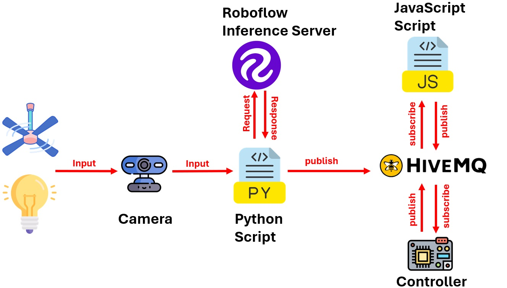
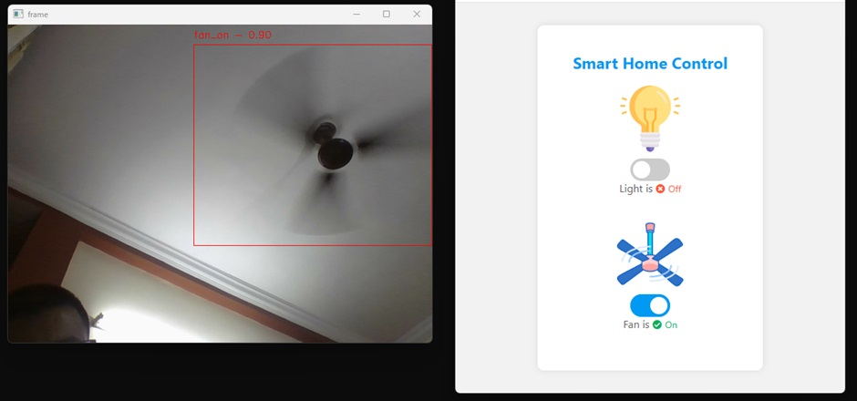
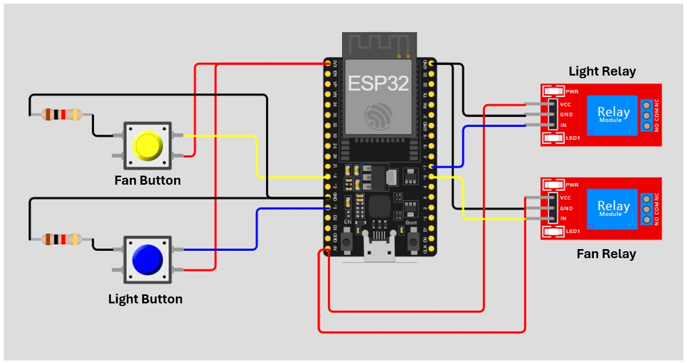

# Smart Home Monitoring and Control using Computer Vision and IoT
A smart home control system integrating Computer Vision and IoT for automated and manual control of appliances.

  
<h3>Working of System</h3>

  
<h3>Output of System</h3>

  
<h3>Circuit Diagram</h3>

